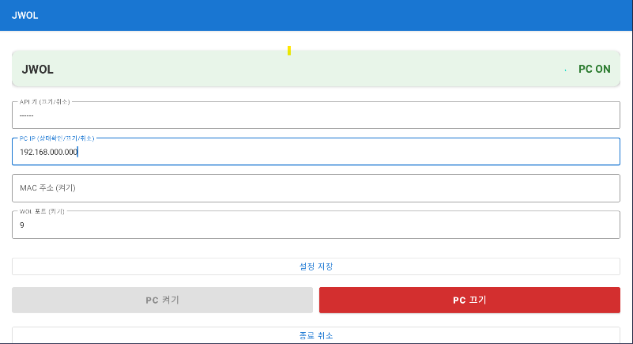

# WOLmate - Wake on LAN & Remote Shutdown

Android 앱으로 PC를 원격으로 켜고 끄는 솔루션.

## 앱 화면



| 영역 | 설명 |
|------|------|
| **상단 카드** | PC 연결 상태 표시 — 초록 **PC ON** / 빨강 **PC OFF** |
| **API 키** | 서버 인증용 키 (길게 터치하면 수정 가능) |
| **PC IP** | 대상 PC의 IP 주소 (상태확인/종료에 사용) |
| **MAC 주소** | WOL 매직 패킷 전송에 사용되는 물리 주소 |
| **WOL 포트** | 매직 패킷 전송 포트 (기본값: 9) |
| **설정 저장** | 입력한 설정을 저장 |
| **PC 켜기** | WOL 매직 패킷을 보내 PC 부팅 (PC OFF 상태에서 활성화) |
| **PC 끄기** | 서버에 종료 명령 전송 (PC ON 상태에서 활성화, 빨간 버튼) |
| **종료 취소** | 진행 중인 종료를 취소 |

## 설치 방법

### 1단계: PC에 Shutdown Server 설치 (Windows)

1. `WOLmate-Setup.exe` 실행
2. 설치 마법사 진행 (기본 경로: `C:\Program Files\WOLmate\`)
3. 설치 완료 시 바탕화면에 `WOLmate-Info.txt` 파일 생성됨
4. `WOLmate-Info.txt`에 적힌 **API 키**, **MAC 주소**, **IP 주소**를 메모

> **참고:** 외부 네트워크(집 밖)에서 사용하려면 공유기 포트포워딩, DDNS 등의 설정이 별도로 필요하며, 이는 사용자의 네트워크 환경에 따라 다르므로 각자 설정해야 합니다.

`WOLmate-Info.txt` 예시:
```
WOLmate - PC Information
=======================

Install Path: C:\Program Files\WOLmate

API Key: A00000000000000

-- Network Adapters --
[이더넷]
  MAC: 00:00:00:00:00:00
  IP: 000.000.0.00

WOL Port: 9
```

### 2단계: Android 앱 설치

1. `WOLmate.apk`를 폰에 설치
2. 앱 실행 후 아래 정보 입력:

| 항목 | 설명 | 기본값 |
|------|------|--------|
| API 키 | `WOLmate-Info.txt`에 적힌 인증 키 | (설치 시 자동 생성) |
| PC IP | 대상 PC IP 주소 | 192.168.0.10 |
| MAC 주소 | WOL용 MAC 주소 | - |
| WOL 포트 | WOL 매직 패킷 포트 | 9 |

3. **설정 저장** 터치
4. PC 상태가 **PC ON** (초록) 또는 **PC OFF** (빨강)으로 표시되면 정상

### 앱 추가 설정

| 항목 | 설명 | 기본값 |
|------|------|--------|
| 종료 딜레이 | 종료까지 대기 시간 (초) | 3 |
| 상태확인 주기 | PC 상태 폴링 간격 (초) | 5 |
| 즉시 종료 | 알림 없이 즉시 강제 종료 | OFF |

## 사용법

| 버튼 | 동작 |
|------|------|
| **PC 켜기** | WOL 매직 패킷 전송 (PC 부팅) |
| **PC 끄기** | 원격 종료 (딜레이 후 강제 종료) |
| **종료 취소** | 진행 중인 종료 취소 |

- PC가 켜져 있으면 끄기 버튼 활성화, 꺼져 있으면 켜기 버튼 활성화
- 즉시 종료(silent) 설정 시 알림 없이 바로 종료됨

## 제거 방법

### 방법 1: Windows 설정
설정 → 앱 → **WOLmate Shutdown Server** → 제거

### 방법 2: 직접 실행
`C:\Program Files\WOLmate\uninstall.exe` 실행

제거 항목:
- wolmate.exe 프로세스 종료
- 작업 스케줄러 (WOLmate_ShutdownServer, WOLmate_ShutdownServer_Watchdog)
- 방화벽 규칙
- 설치 폴더 (`C:\Program Files\WOLmate\`)
- 레지스트리 (프로그램 추가/제거 항목)

## 문제 해결

### PC 상태가 계속 "확인 중..."으로 표시됨
- PC와 폰이 **같은 네트워크**에 연결되어 있는지 확인
- PC에서 WOLmate 서버가 실행 중인지 확인 (작업 관리자에서 `wolmate.exe` 검색)
- PC IP 주소가 정확한지 확인

### PC 켜기가 안 됨
- **MAC 주소**가 정확한지 확인 (`WOLmate-Info.txt` 참고)
- PC BIOS/UEFI에서 **Wake on LAN 기능이 활성화**되어 있는지 확인
- 공유기와 PC가 유선(이더넷)으로 연결되어 있는지 확인 (Wi-Fi WOL은 대부분 미지원)
- WOL 포트가 9인지 확인

### PC 끄기가 안 됨
- **API 키**가 서버와 앱에서 동일한지 확인
- PC에서 방화벽이 9770 포트를 허용하는지 확인
- 서버가 실행 중인지 확인 (작업 관리자에서 `wolmate.exe` 검색)

### 서버가 자동으로 시작되지 않음
- 작업 스케줄러에서 `WOLmate_ShutdownServer` 작업이 등록되어 있는지 확인
- 워치독 작업 `WOLmate_ShutdownServer_Watchdog`이 활성화되어 있는지 확인
- 수동 시작: `C:\Program Files\WOLmate\wolmate.exe` 실행

### 외부 네트워크에서 사용하고 싶은 경우
- **PC 종료/상태확인**: 공유기에서 9770 포트 포트포워딩 설정 후 공인 IP 또는 DDNS 주소를 앱에 입력
- **PC 켜기(WOL)**: 공유기가 Directed Broadcast 또는 WOL 포트포워딩을 지원해야 함 (대부분의 가정용 공유기에서는 제한적)

---

## 기술 정보

### 구성

| 구성 요소 | 설명 |
|-----------|------|
| **WOLmate 앱** (Android) | WOL 패킷 전송, 원격 종료/취소, PC 상태 모니터링 |
| **WOLmate Shutdown Server** (Windows) | PC에서 실행되는 HTTP 서버. 종료/취소 명령 수신, 상태 응답 |
| **WOLmate-Setup.exe** (NSIS 인스톨러) | wolmate.exe를 Program Files에 설치/제거 |

### API 엔드포인트

서버 포트: `9770`

| Method | Path | 파라미터 | 설명 |
|--------|------|---------|------|
| GET | `/ping` | - | PC 상태 확인 (200 = 켜짐) |
| POST | `/shutdown` | `delay`, `silent`, `key` | PC 종료 |
| POST | `/cancel` | `key` | 종료 취소 |

#### 파라미터 상세

- `delay` - 종료 딜레이 (초, 기본값: 3)
- `silent` - `1`이면 알림 없이 즉시 강제 종료 (`shutdown /s /f /t 0`)
- `key` - API 키 (서버에 설정된 경우 필수)

### 프로젝트 구조

```
WOLApp/
├── app/                              # Android 앱
│   └── src/main/
│       ├── java/com/wol/app/
│       │   ├── MainActivity.kt       # 메인 화면
│       │   ├── WolSender.kt          # WOL 패킷 전송
│       │   └── WolReceiver.kt        # 브로드캐스트 리시버
│       └── res/layout/
│           └── activity_main.xml     # UI 레이아웃
├── shutdown-server/
│   ├── wolmate-server.py             # 서버 소스 (Python → wolmate.exe)
│   ├── wolmate-setup.nsi             # NSIS 인스톨러 스크립트
│   ├── wolmate-start.vbs             # CMD 창 숨김용 VBS 래퍼
│   ├── gen-apikey.ps1                # API 키 생성 스크립트
│   └── show-info.ps1                 # 설치 정보 저장 스크립트
└── output/                           # 빌드 결과물
    ├── WOLmate-Setup.exe             # NSIS 인스톨러
    └── WOLmate.apk                   # Android 앱
```

### 빌드

#### Shutdown Server
```bash
cd shutdown-server
# 1. wolmate.exe 빌드 (onedir 모드)
pyinstaller wolmate-server.spec --distpath dist --workpath build --noconfirm
# 2. NSIS 인스톨러 빌드
makensis wolmate-setup.nsi
# → output/WOLmate-Setup.exe 생성
```

#### Android 앱
```bash
./gradlew assembleDebug
cp app/build/outputs/apk/debug/app-debug.apk output/WOLmate.apk
```
